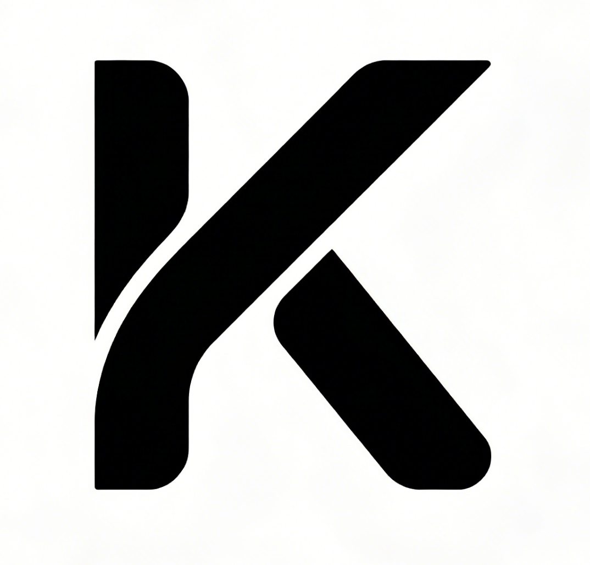

<h1>Nexogic Kordec</h1>

> Kordec作为Korelin的重构继承版,继承了大部分的语法,
> 但通过强制纯面向对象范式，将过程式代码结构全面转型为基于类和消息传递的编程模型。

   
   <b>Kordec LOGO</b>
   

      
      

      
      
   

## 解决的Bug

- Korelin 包管理寻址错误
  - 解决方案: 加强处理逻辑
- Korelin 虚拟机容易溢出,gc不强力
  - 解决方案: 重构地底层代码
- Korelin 对于C的扩展易出错,标准库试验性强
  - 解决方案: 新增语法, 将c扩展结构开放更加底层
- Korelin 代码可读性不强
  - 解决方案: 将过程式代码结构全面转型为基于类和消息传递的编程模型。

   Copyright (c) 2026 Nexogic. Released under Apache 2.0 License.

